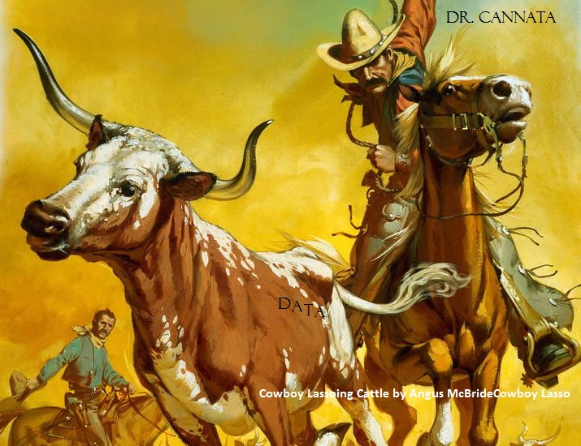
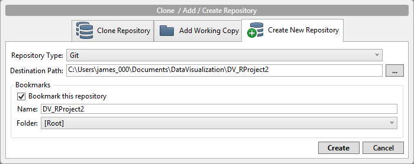
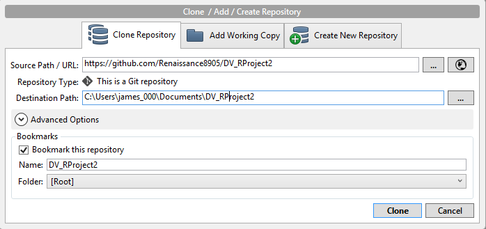
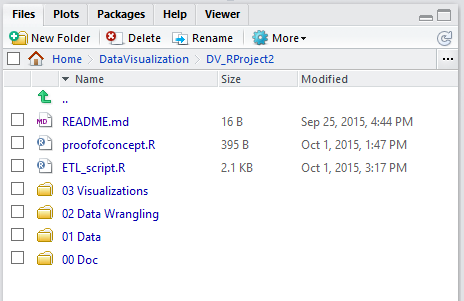
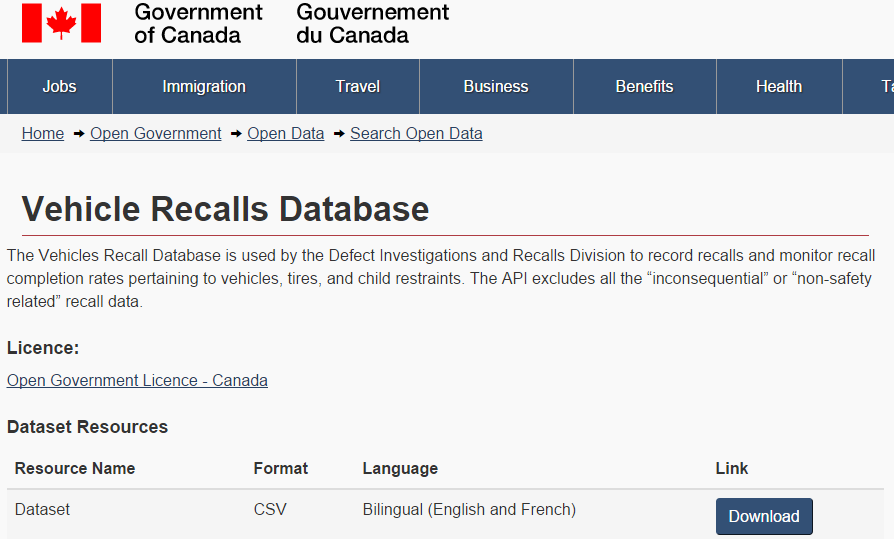
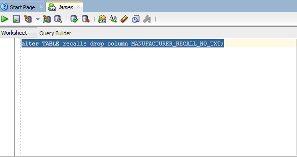

 

## 00. Create/Clone a github repository
Go to SourceTree software. Create new git repository in DataVisualization folder (on same level as DrCannata folder).

If did not create the repo, clone the repo in SourceTree software.

## 01. Create RStudio Project
Create an RStudio project in the project folder.

## 02. Setup RStudio 
 Create three folders in RStudio Project:  
   **00 Doc**: where .Rmd lives  
   **01 Data**: where data will be stored  
   **02 Visualizations**: where data is explored in ggplot 
   

## 03. Download .CSV File

Download csv file documenting all vehicle recalls in Cannada.

## 04. ETL

## 05. Peculiarities
  -removing manufacturer no as this caused floating point errors:
  

## 06. Visualizations

### Subset
### Summary

### Our Visualizations
