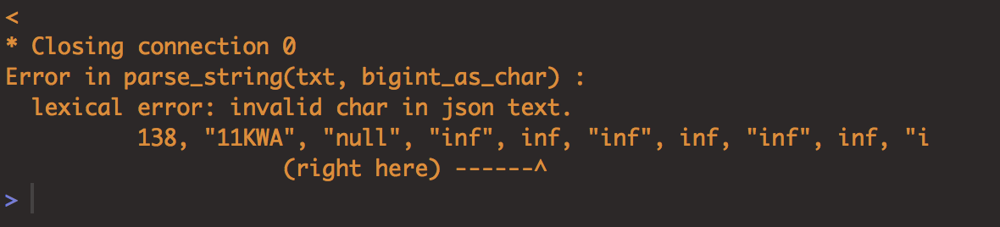
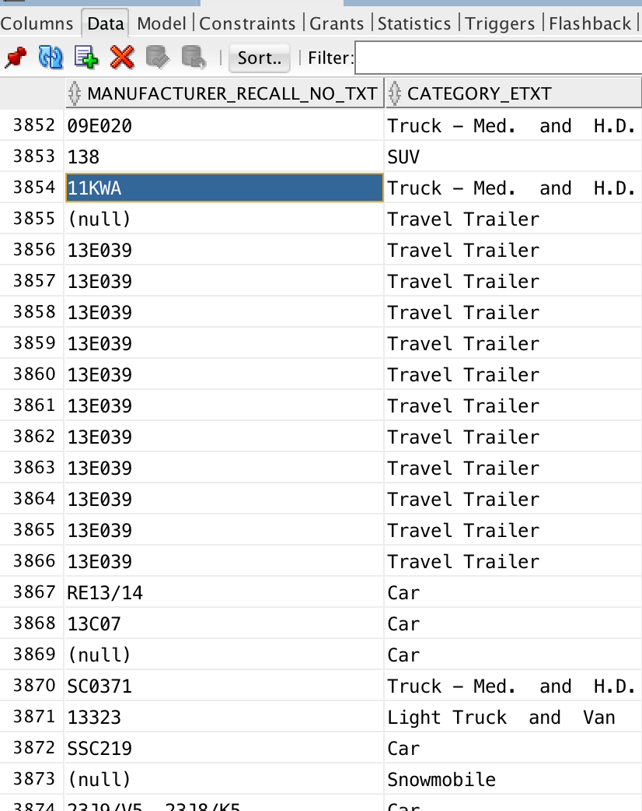
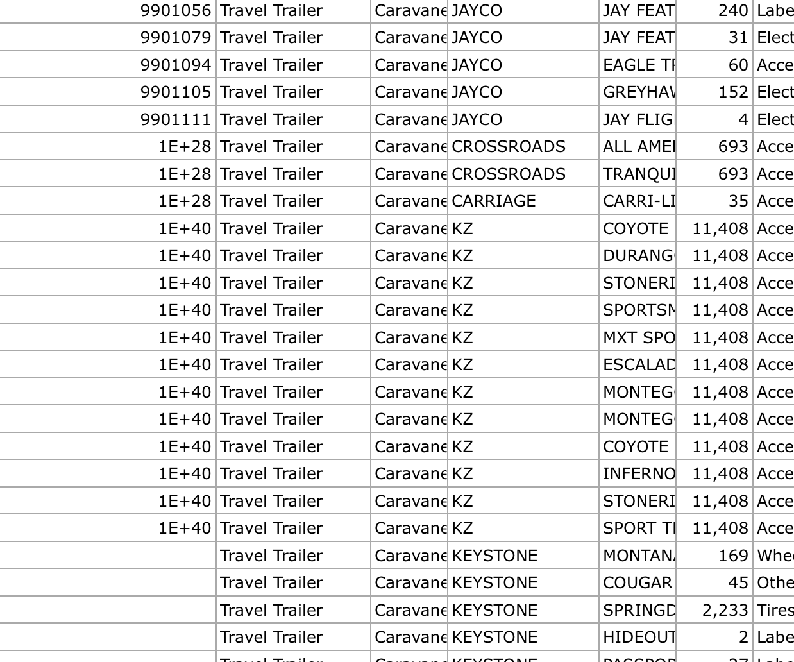
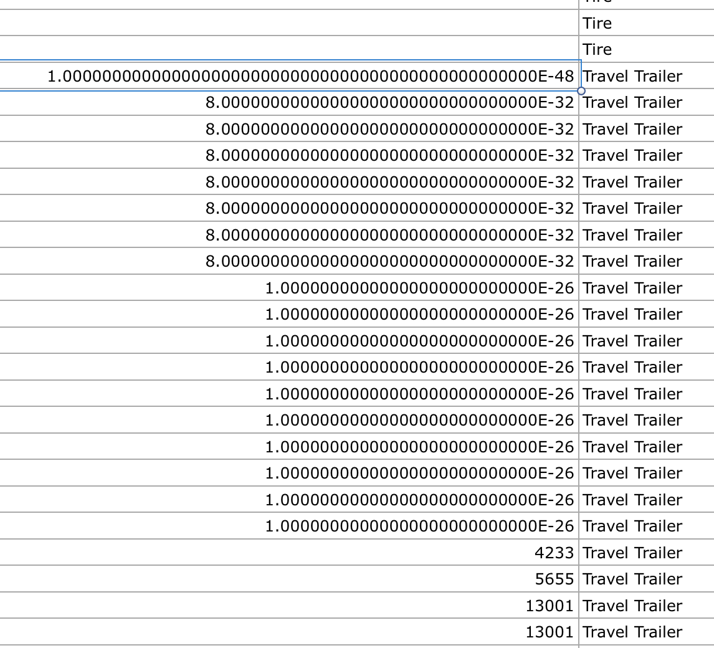
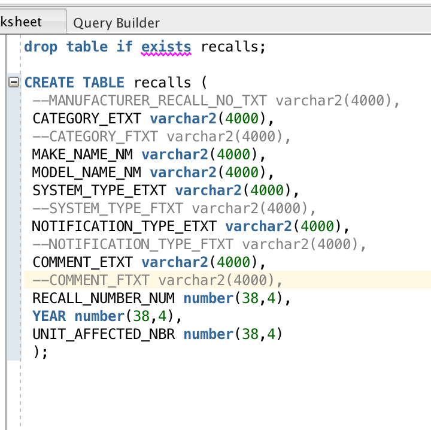
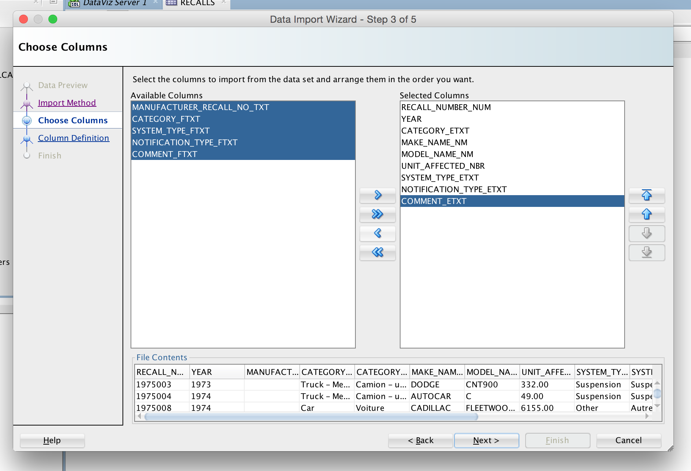

 

## 00. Create/Clone a github repository
Go to SourceTree software. Create new git repository in DataVisualization folder (on same level as DrCannata folder).


If did not create the repo, clone the repo in SourceTree software.


## 01. Create RStudio Project
Create an RStudio project in the project folder.


## 02. Setup RStudio 
 Create three folders in RStudio Project:  
   **00 Doc**: where .Rmd lives  
   **01 Data**: where data will be stored  
   **02 Visualizations**: where data is explored in ggplot 
   


## 03. Download .CSV File

Download csv file documenting all vehicle recalls in Cannada.


## 04. ETL

## 05. Peculiarities
  -Encountered JSON parsing error when trying to fetch database



  -After some sleuthing, pinpointed problem rows in database:
  


  -The values looked strange, but nothing about them explained why JSON had read them as infinity. The csv files held some answers though...
  



  -A-ha! Some values in the original csv contained some codes in a number-'E'-number format, and upon reformatting they had been parsed as scientific notation.
  
  -Very few rows even contained values in the offending column, so the simplest solution seemed to be to drop the column entirely from our data. There didn't seem to be any pattern to Manufacturer's recall codes anyway.
  
  -Oracle was reacting badly to the offending data, so we eventually opted to drop the table entirely and rebuild it with a modified SQL statement.
  



  -While we were at it we pulled out four columns that were french translations of other columns. None of us speak French.

## 06. Summary and Subset

Creating dataframe from Oracle's database with SQL query:

```{r, warning = FALSE}
require("jsonlite")
require("RCurl")
df <- data.frame(fromJSON(getURL(URLencode('129.152.144.84:5001/rest/native/?query="select * from recalls"'),httpheader=c(DB='jdbc:oracle:thin:@129.152.144.84:1521/PDBF15DV.usuniversi01134.oraclecloud.internal', USER='cs329e_qan74', PASS='orcl_qan74', MODE='native_mode', MODEL='model', returnDimensions = 'False', returnFor = 'JSON'), verbose = TRUE), ))
```

### Summary of Dataframe

```{r}
summary(df)
```  

### Subset of Dataframe

A subset of recalls dataframe where number of units affected for each category is greater than 400,000:

```{r, warning = FALSE}
head(subset(df, as.numeric(as.character(UNIT_AFFECTED_NBR)) > 400000))
```

## 07. Visualizations

### Plot #1. Honda/Acura Recalls

Description: 

- My workflow only looks at 4 columns: Maker (filtered as Honda or Acura), System Failure Type, Number of Units Affected and Year.

- The new dataframe is grouped by Year, and further filtered by System Failure Type to ignore entries that are either "Accessories" or "Label" (as I consider "Accessories" and "Label" to be trivial recall reasons).

```{r}
require(tidyr)
require(dplyr)
require(ggplot2)
quandf <- df %>% select(MAKE_NAME_NM, SYSTEM_TYPE_ETXT, UNIT_AFFECTED_NBR, YEAR) %>% group_by(YEAR) %>% filter(MAKE_NAME_NM %in% c("HONDA", "ACURA"), SYSTEM_TYPE_ETXT != "Accessories", SYSTEM_TYPE_ETXT != "Label")
```

```{r}
ggplot() + 
  coord_cartesian() + 
  scale_x_continuous() +
  scale_y_continuous() +
  labs(title='Honda/Acura Recalls') +
  labs(x="YEAR", y="UNITS AFFECTED") +
  layer(data=quandf, 
        mapping=aes(x= as.numeric(as.character(YEAR)), y=as.numeric(as.character(UNIT_AFFECTED_NBR)), color=SYSTEM_TYPE_ETXT), 
        stat="identity", 
        stat_params=list(), 
        geom="point",
        geom_params=list(), 
        position=position_jitter(width=0.3, height=0)
)
```

Comment:

- The generated plot shows the number of Honda/Acura units recalled by each type of system failure over the years.

- The interesting point here is the abnormally high number of units recalled due to Airbag problem/failure in the period 2000-2010. The number is staggering compared to other scattered recalls (more than 700,000 units each year compared to the norm of below 200,000 units for other types of recall), occupying a conspicuous horizontal line at the top of the graph.

- In fact, I wonder whether this might correspond to the major Takata airbag recall by Honda. The airbags, made by major parts supplier Takata, were mostly installed in cars from model year 2002 through 2008.


### Plot #2: Recalls Affecting Child Safety

- My dataframe is limited to those recalls whose descriptions make reference to a child or children, and excludes manufacturers of Car Seats and Booster Seats (because they are products solely for children, and their recalls would overshadow the rate at which other manufacturers' recalls were child-related)

- This workflow looks at four variables within the aforementioned subset: Manufacturer, Number of Units Affected, Category, and Year (grouped by decade). It shows changes in frequency and scope of child-safety-related recalls across companies and time.

```{R}
df %>% filter(grepl("[Cc]hild|CHILD", COMMENT_ETXT)) %>% filter(CATEGORY_ETXT != "Child Car Seat" & CATEGORY_ETXT != "Booster Seat") %>% filter(YEAR > 1900) %>% mutate(decade = ntile(YEAR,5)) %>% group_by(MAKE_NAME_NM, YEAR, UNIT_AFFECTED_NBR, CATEGORY_ETXT, decade) %>%  ggplot(aes(x=MAKE_NAME_NM, y=UNIT_AFFECTED_NBR, color=CATEGORY_ETXT)) + geom_point() + theme(axis.text.x = element_text(angle = 90, hjust = 1)) + labs(title="Think Of The Children:\nRecalls Affecting Child Safety") + labs(x="Company(Child Seat Mfrs Excluded)", y="Scope of Recall (# Units Affected)") + facet_grid(~CATEGORY_ETXT~decade)
```

- In terms of total units recalled over the last 45 years, Ford is the clear frontrunner. However, Suzuki holds the distinction of having one of the two most widespread recalls, and having it in the 21st century-- at a point when most manufacturer's child-safety recalls were on the decline.

